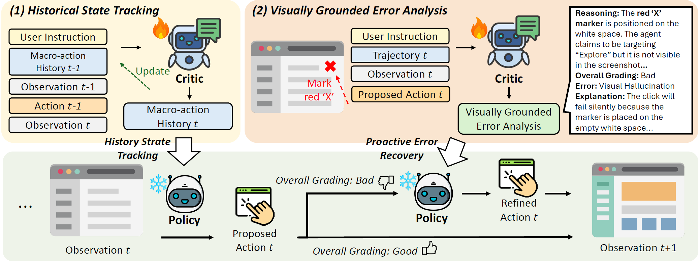

# [A History-Aware Visually Grounded Critic for Computer Use Agents](TBD)

[](TBD)
[](https://opensource.org/licenses/MIT)

[Jaewoo Lee](https://g-jwlee.github.io/) | [Zaid Khan](https://zaidkhan.me/) | [Archiki Prasad](https://archiki.github.io/) | [Justin Chih-Yao Chen](https://dinobby.github.io/)  | [Supriyo Chakraborty](https://scholar.google.com/citations?hl=en&user=UIM7nGwAAAAJ) | [Kartik Balasubramaniam](https://scholar.google.com/citations?hl=en&user=Eq7sJT0AAAAJ) | [Sambit Sahu](https://scholar.google.com/citations?hl=en&user=lhCvmjkAAAAJ) | [Elias Stengel-Eskin](https://esteng.github.io/) | [Hyunji Lee](https://amy-hyunji.github.io/) | [Mohit Bansal](https://www.cs.unc.edu/~mbansal/)

## Overview
Computer Use Agents (CUAs) frequently struggle with solving long-horizon tasks in complex Graphical User Interface (GUI) environments, often becoming trapped in short-sighted decision loops or failing to detect spatial errors on visual interfaces. 
To overcome these limitations, we introduce HIVIS (History-aware Visually grounded), a test-time intervention framework designed to equip CUAs with history state tracking and visually grounded error analysis.
Inside our framework, we propose HiVis-critic, a multimodal model to serve as an intervention engine with these dual critique generation capabilities.

<center></center>
<p>

📝 **HiVis-critic for history state tracking**: maintains a macro-action history, a compact record of past interactions to date, recursively comparessing past interactions into multi-step achieved goals, enabling better history-aware planning of policieis over long horizons.

🎯 **HiVis-critic for visually grounded error analysis**: verifies raw execution coordinates against actual visual states. If a proposed action is flawed, the model identifies the error dimension to provide the policy with corrective guidance before execution.<br>

</p>

## Install
Please follow the installation instructions from [llama-factory](https://github.com/hiyouga/LlamaFactory).

## Critic Data construction
First, download the GUI trajectories corpus source from [ScaleCUA-Data](https://huggingface.co/datasets/OpenGVLab/ScaleCUA-Data). Copy the jsonl files that contains long-horizon GUI trajectories in web, android, mac, or windows environments into ./ScaleCUA-Data/refined_annotations directory.

For History State Tracking task, run
```shell
python examples/data_preprocess/new_preprocess_scalecua_progress_summary_annotation_grounding.py --local_dir ./benchmarks/scalecua_summary_annotation
python examples/data_preprocess/new_scalecua_summary_sft_llama_factory.py --local_dir ./benchmarks/scalecua_summary_annotation --summary_annotation ./benchmarks/scalecua_summary_annotation/sequential_summary_annotation.jsonl --tokenizer_path Qwen/Qwen3-VL-8B-Thinking --max_prompt_length 16384
```

For Visually Grounded Error Analysis, run <br>
Step 1. State-transition Extraction
```shell
python examples/data_preprocess/new_preprocess_scalecua_state_transition_extraction.py --local_dir ./benchmarks/scalecua_state_transition_extraction
```

Step 2. Plausible Error Synthesis
```shell
python examples/data_preprocess/new_preprocess_scalecua_negative_action_generation.py --state_transition_annotation ./benchmarks/scalecua_state_transition_extraction/state_transition_annotation.jsonl --save_dir ./benchmarks/new_scalecua_preference
python examples/data_preprocess/new_preprocess_scalecua_negative_action_filtering.py --local_dir /nas-ssd2/jwoolee/code/verl_vl/benchmarks/new_scalecua_preference
```

Step 3. Multimodal Rationale Extraction
```shell
python examples/data_preprocess/new_preprocess_scalecua_critic_chosen_dataset_grounding_new.py --annotation_dir /nas-ssd2/jwoolee/code/verl_vl/benchmarks/new_scalecua_preference --local_dir /nas-ssd2/jwoolee/code/verl_vl/benchmarks/new_scalecua_critic_fixed
python examples/data_preprocess/new_preprocess_scalecua_critic_chosen_dataset_grounding_new_no_verbal.py --annotation_dir /nas-ssd2/jwoolee/code/verl_vl/benchmarks/new_scalecua_preference --local_dir /nas-ssd2/jwoolee/code/verl_vl/benchmarks/new_scalecua_critic_fixed

python examples/data_preprocess/new_preprocess_scalecua_critic_rejected_dataset_grounding_new.py --annotation_dir /nas-ssd2/jwoolee/code/verl_vl/benchmarks/new_scalecua_preference --local_dir /nas-ssd2/jwoolee/code/verl_vl/benchmarks/new_scalecua_critic_fixed
python examples/data_preprocess/new_preprocess_scalecua_critic_rejected_dataset_grounding_new_no_verbal.py --annotation_dir /nas-ssd2/jwoolee/code/verl_vl/benchmarks/new_scalecua_preference --local_dir /nas-ssd2/jwoolee/code/verl_vl/benchmarks/new_scalecua_critic_fixed

python examples/data_preprocess/new_preprocess_scalecua_merge_data.py
python examples/data_preprocess/new_scalecua_critique_sft_llama_factory.py --local_dir ./benchmarks/new_scalecua_critic_fixed --chosen_annotation ./benchmarks/new_scalecua_critic_fixed/critic_chosen_dataset.jsonl --rejected_annotation ./benchmarks/new_scalecua_critic_fixed/critic_rejected_dataset.jsonl --tokenizer_path Qwen/Qwen3-VL-8B-Thinking --max_prompt_length 16384
```

## Download Models
Download our PRInTS from huggingface:

| Model | Download Link |
|-------|---------------|
| **HiVis-critic** | [](https://huggingface.co/Jaew00Lee/HiVis-critic) |


## Training
We train HiVis-critic on Qwen3-VL-8B-Thinking with our constructed critc data.
```shell
llamafactory-cli train examples/train_full/qwen3vl_full_sft_critic_merged.yaml
```

## Evaluation
For evaluation we use the [ScaleCUA](https://github.com/OpenGVLab/ScaleCUA) evaluation pipeline.


## Bibtex
```
@article{lee2026hisvis,
      title={A History-Aware Visually Grounded Critic for Computer Use Agents},
      author={Jaewoo Lee and Zaid Khan and Archiki Prasad and Justin Chih-Yao Chen and Supriyo Chakraborty and Kartik Balasubramaniam and Sambit Sahu and Elias Stengel-Eskin and Hyunji Lee and Mohit Bansal},
      year={2026},
      journal={arXiv preprint arXiv:tbd},
      url={https://arxiv.org/abs/tbd},
}
```

